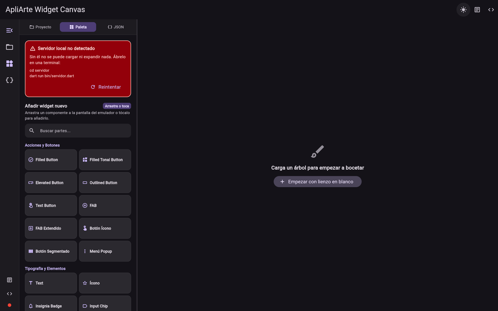

# ApliArte Widget Canvas

> **Bocetea, anota y diseña sobre tu app Flutter real** — Lienzo visual interactivo con Material 3 Expressive, capa sobre captura de pantalla y exportación quirúrgica de prompts.

🌐 **[erbolamm.github.io/apliarte-widget-canvas](https://erbolamm.github.io/apliarte-widget-canvas/)** · 📄 **[Landing Page](https://erbolamm.github.io/apliarte-widget-canvas/landing.html)**

[](#cómo-funciona)
[](#estructura-del-repo)
[](LICENSE)

<p align="center">
  
</p>

---

**[🇪🇸 Español](#español) · [🇬🇧 English](#english)**

## Español

> **Editor Visual y Anotador para Flutter**: edita y anota sobre tu app **real**, no sobre un lienzo en blanco.
> Carga capturas reales de tu app en el emulador, anota cambios con **Callouts numerados (①, ②, ③)**, flechas y cajas de rediseño,
> añade widgets de la **suite completa Material 3 (46+ componentes)**, edita propiedades en el **Inspector lateral** y
> genera código con el **motor de IA integrado (Groq)** o exporta un prompt quirúrgico listo para tu agente favorito
> (Claude Code, Codex, Antigravity, Copilot...).

Inspirado en flujos modernos de diseño Material 3 Expressive,
construido desde cero, nativo para Flutter — no dibuja aproximaciones, usa widgets Material reales.

## Cómo funciona

1. **Explora y Extrae**: Elige tu pantalla o widget desde el **Explorador Inteligente** (análisis AST real con `package:analyzer` — no necesita `pub get` del proyecto objetivo).
2. **Capa Visual sobre App Real**: Opcionalmente, carga una captura de tu app real en el marco del emulador (Móvil V, H o Web) con opacidad regulable para diseñar encima sin lidiar con BLoCs ni GetIt.
3. **Anota y Diseña**: Coloca Callouts numerados con instrucciones técnicas, flechas indicadoras, cajas de enfoque o reglas de medición en píxeles. Añade widgets Material 3 desde la paleta.
4. **Inspector Lateral M3**: Edita en tiempo real textos, colores HEX, bordes, dimensiones, iconos (con buscador oficial de Material) y notas de comportamiento.
5. **Historial Completo**: `Cmd+Z / Ctrl+Z` (Deshacer) y `⇧Cmd+Z / Ctrl+Y` (Rehacer) en cada cambio.
6. **Genera Código con IA o Exporta Prompt**: Genera código Flutter nativo directamente con el motor de IA (Groq `llama-3.3-70b-versatile`) o exporta un prompt quirúrgico con pasos numerados.

## Estructura del repo

```
extractor/   Dart puro. Lee un archivo + clase y devuelve el árbol de widgets (JSON o texto).
servidor/    Servidor HTTP local (solo localhost). Puente entre el navegador y el extractor,
             porque Flutter Web no puede lanzar procesos del sistema por sí mismo — mismo
             patrón que usa Flutter DevTools oficial.
canvas/      La app Flutter Web: el editor visual en sí.
```

## Antes de empezar: ¿tienes `fvm`?

Este proyecto necesita Flutter **3.47.2** exacto (por eso los comandos abajo llevan el prefijo
`fvm`). `fvm` es una herramienta que deja tener varias versiones de Flutter instaladas a la vez sin
que se pisen entre proyectos — la usa el propio equipo de Flutter para sus repos internos.

**Comprueba si ya lo tienes:**
```bash
fvm --version
```

- **Si te devuelve una versión** → ya lo tienes, salta directo a "Cómo probarlo" abajo.
- **Si dice "command not found"** → instálalo:
  ```bash
  # macOS (Homebrew)
  brew install fvm

  # Cualquier sistema con Dart/Flutter ya instalado (Windows, Linux, macOS)
  dart pub global activate fvm
  ```
  Más opciones de instalación (Chocolatey, script manual): https://fvm.app/documentation/getting-started/installation

Una vez instalado, `fvm` detecta solo la versión pinada de este proyecto (`.fvmrc`) y la descarga
la primera vez que uses un comando `fvm flutter ...` aquí dentro — no hace falta configurar nada más.

## Cómo probarlo

⚠️ Cada paso asume que abres una **terminal nueva** en la raíz del proyecto
(`apliarte-widget-canvas/`) — si los pegas todos seguidos en la misma terminal, el `cd` del
paso 2 falla porque sigues dentro de `servidor/` del paso 1.

```bash
# Terminal 1 — servidor local (necesario para expandir widgets propios anidados)
cd apliarte-widget-canvas/servidor
dart run bin/servidor.dart
```

Si da error de "Address already in use": ya tienes un servidor corriendo de una vez anterior.
Ciérralo con `lsof -i :8799` (te da el PID) y `kill <PID>`, o simplemente sigue usando el que
ya está corriendo — no hace falta relanzarlo.

```bash
# Terminal 2 — el canvas
cd apliarte-widget-canvas/canvas
fvm flutter run -d chrome
```

Ya está — con las dos terminales corriendo, ya no necesitas escribir rutas a mano: el canvas incluye un **Explorador Inteligente** que escanea automáticamente todas las pantallas y widgets de tu proyecto. Eliges tu pantalla con un clic, o cargas una captura de tu app real en el emulador para empezar a diseñar y anotar inmediatamente.

*(Si prefieres generar el JSON tú mismo, la opción sigue ahí — "Alternativa: pegar JSON a mano",
colapsada en el panel — útil si el servidor no está corriendo o quieres guardar el JSON aparte.)*

Ver `ESTADO.md` para la hoja de ruta completa y `DECISIONES_DE_DISENO.md` para el porqué de cada
decisión técnica (por qué arquitectura nativa en Flutter, por qué Flutter Web y no Jaspr, comparación
contra Widgetbook/FlutterViz/flutter_ide, etc.).

---

## English

> **Visual Editor & Screen Annotator for Flutter**: visual editor that reads a **real** Flutter project, not a blank canvas.
> Load real app screenshots into the emulator frame, annotate changes with **numbered Callouts (①, ②, ③)**, arrows, and redesign boxes,
> add widgets from the **full Material 3 suite (46+ components)**, edit properties in the **Side Inspector**, and
> generate code with the **integrated AI engine (Groq)** or export a surgical prompt ready for your favorite agent
> (Claude Code, Codex, Antigravity, Copilot...).

Inspired by modern Material 3 Expressive design workflows,
built from scratch, native to Flutter — it uses actual Flutter Material widgets.

### How it works

1. **Explore and Extract**: Pick your screen or widget from the **Smart Project Explorer** (real AST analysis with `package:analyzer` — no `pub get` needed on the target project).
2. **Real App Overlay**: Optionally load a real app screenshot inside the emulator frame (Mobile V, H, or Web) with adjustable opacity to design on top without fighting BLoCs or GetIt.
3. **Annotate & Design**: Place numbered Callouts with technical instructions, arrows, redesign boxes, or pixel measurement rulers. Add Material 3 widgets from the palette.
4. **M3 Side Inspector**: Real-time editing for text, HEX colors, border radii, widths, official Material icon picker, and behavior notes.
5. **Full History**: `Cmd+Z / Ctrl+Z` (Undo) and `⇧Cmd+Z / Ctrl+Y` (Redo) on every single edit.
6. **Generate Code with AI or Export Prompt**: Generate native Flutter code directly with the AI engine (Groq `llama-3.3-70b-versatile`) or export a step-by-step surgical prompt.

### Repo structure

```
extractor/   Pure Dart. Reads a file + class and returns the widget tree (JSON or text).
servidor/    Local HTTP server (localhost only). Bridge between the browser and the extractor,
             because Flutter Web can't launch system processes by itself — same pattern
             official Flutter DevTools uses.
canvas/      The Flutter Web app: the visual editor itself.
```

### Before you start: do you have `fvm`?

This project needs Flutter **3.47.2** exactly (that's why the commands below are prefixed with
`fvm`). `fvm` lets you keep several Flutter versions installed side by side without them clashing
between projects — the Flutter team itself uses it for their own repos.

**Check if you already have it:**
```bash
fvm --version
```

- **Returns a version?** → you're set, skip straight to "Try it" below.
- **"command not found"?** → install it:
  ```bash
  # macOS (Homebrew)
  brew install fvm

  # Any system with Dart/Flutter already installed (Windows, Linux, macOS)
  dart pub global activate fvm
  ```
  More install options (Chocolatey, manual script): https://fvm.app/documentation/getting-started/installation

Once installed, `fvm` picks up this project's pinned version (`.fvmrc`) automatically and
downloads it the first time you run an `fvm flutter ...` command here — nothing else to configure.

### Try it

⚠️ Each step assumes a **new terminal** opened at the project root (`apliarte-widget-canvas/`) —
pasting all three in the same terminal breaks step 2's `cd`, since you're still inside `servidor/`
from step 1.

```bash
# Terminal 1 — local server (needed to expand your own nested widgets)
cd apliarte-widget-canvas/servidor
dart run bin/servidor.dart
```

"Address already in use"? A server from a previous run is still up. Find it with
`lsof -i :8799` and `kill <PID>`, or just keep using the one that's already running.

```bash
# Terminal 2 — the canvas
cd apliarte-widget-canvas/canvas
fvm flutter run -d chrome
```

That's it — with both terminals running, type the `.dart` file path and the class name right in
the canvas, then hit "Cargar en el canvas". No third terminal, no running the extractor by hand:
the canvas asks the server for it directly.

*(If you'd rather generate the JSON yourself, that option is still there — "Alternativa: pegar
JSON a mano", collapsed in the panel — useful if the server isn't running or you want to save the
JSON separately.)*

See `ESTADO.md` for the full roadmap and `DECISIONES_DE_DISENO.md` for the reasoning behind every
technical decision (why native Flutter architecture, why Flutter Web instead of Jaspr, comparison
against Widgetbook/FlutterViz/flutter_ide, etc. — currently in Spanish, translation welcome).

---

## Autor
Javier Mateo (ApliArte) — github.com/erbolamm

## 💬 Una nota personal del autor / A personal note from the author

> ⚠️ **Borrador — pendiente de que Javier lo escriba/revise con su propia voz antes de publicar.**
> Lo que sigue es un punto de partida, no el mensaje final.

ℹ️ Nota: El texto siguiente es un mensaje personal del autor, escrito en varios idiomas para que pueda leerlo gente de todo el mundo. Esto no implica que el proyecto tenga soporte funcional completo en esos idiomas.

ℹ️ Note: The text below is a personal message from the author, written in several languages so people around the world can read it. This does not imply full multilingual feature support in those languages.

<details>
<summary>🇪🇸 Español</summary>

Hice este proyecto porque me cansé de que las herramientas de diseño visual para Flutter no lean tu código real — o parten de cero, o no entienden qué widgets ya construiste tú. Esto sí lo hace: abre tu proyecto de verdad, y te deja bocetar cambios sobre lo que ya existe. Es gratis y open source porque a mí me hubiera gustado tenerlo cuando empecé, sin estudios ni saber inglés, aprendiendo Flutter solo.

</details>

<details>
<summary>🇬🇧 English</summary>

I built this because I got tired of visual design tools for Flutter that don't read your real code — they either start from a blank canvas or have no idea what widgets you've already built. This one does: it opens your actual project and lets you sketch changes on top of what's already there. It's free and open source because I wish I'd had it when I started, self-taught, with no formal education.

</details>

<details>
<summary>🇧🇷 Português</summary>

Criei este projeto porque me cansei de ferramentas de design visual para Flutter que não leem seu código real — ou partem do zero, ou não entendem quais widgets você já construiu. Esta lê: abre seu projeto de verdade e permite esboçar mudanças sobre o que já existe. É gratuito e open source porque eu gostaria de tê-la quando comecei, autodidata, sem formação formal.

</details>

<details>
<summary>🇫🇷 Français</summary>

J'ai créé ce projet parce que j'en avais assez des outils de design visuel pour Flutter qui ne lisent pas votre vrai code — ils partent d'une toile vierge ou ignorent les widgets que vous avez déjà construits. Celui-ci les lit vraiment : il ouvre votre projet réel et vous laisse esquisser des changements sur l'existant. Il est gratuit et open source parce que j'aurais aimé l'avoir à mes débuts, autodidacte, sans formation officielle.

</details>

<details>
<summary>🇩🇪 Deutsch</summary>

Ich habe dieses Projekt gebaut, weil ich es leid war, dass visuelle Design-Tools für Flutter deinen echten Code nicht lesen — sie starten entweder bei null oder wissen nicht, welche Widgets du bereits gebaut hast. Dieses hier liest ihn wirklich: es öffnet dein echtes Projekt und lässt dich Änderungen über das Bestehende skizzieren. Es ist kostenlos und Open Source, weil ich es mir zu Beginn gewünscht hätte, als Autodidakt ohne formale Ausbildung.

</details>

<details>
<summary>🇮🇹 Italiano</summary>

Ho creato questo progetto perché ero stanco degli strumenti di design visivo per Flutter che non leggono il tuo codice reale — o partono da zero, o non capiscono quali widget hai già costruito. Questo li legge davvero: apre il tuo progetto reale e ti lascia abbozzare modifiche su ciò che già esiste. È gratuito e open source perché avrei voluto averlo quando ho iniziato, autodidatta, senza formazione formale.

</details>

## 💥 Compártelo

Si este proyecto te ahorra tiempo o dolores de cabeza boceteando y diseñando apps Flutter, compártelo:

[𝕏 Twitter / X](https://twitter.com/intent/tweet?text=ApliArte%20Widget%20Canvas%20%E2%80%94%20Bocetea%2C%20anota%20y%20dise%C3%B1a%20sobre%20tu%20app%20Flutter%20real%20en%20el%20navegador.&url=https%3A%2F%2Ferbolamm.github.io%2Fapliarte-widget-canvas%2F) · [💼 LinkedIn](https://www.linkedin.com/sharing/share-offsite/?url=https%3A%2F%2Ferbolamm.github.io%2Fapliarte-widget-canvas%2F) · [💬 WhatsApp](https://api.whatsapp.com/send?text=ApliArte%20Widget%20Canvas%20%E2%80%94%20Bocetea%2C%20anota%20y%20dise%C3%B1a%20sobre%20tu%20app%20Flutter%20real%3A%20https%3A%2F%2Ferbolamm.github.io%2Fapliarte-widget-canvas%2F) · [✈️ Telegram](https://t.me/share/url?url=https%3A%2F%2Ferbolamm.github.io%2Fapliarte-widget-canvas%2F&text=ApliArte%20Widget%20Canvas%20%E2%80%94%20Bocetea%2C%20anota%20y%20dise%C3%B1a%20sobre%20tu%20app%20Flutter%20real) · [🟠 Reddit](https://www.reddit.com/submit?url=https%3A%2F%2Ferbolamm.github.io%2Fapliarte-widget-canvas%2F&title=ApliArte%20Widget%20Canvas%20%E2%80%94%20Bocetea%2C%20anota%20y%20dise%C3%B1a%20sobre%20tu%20app%20Flutter%20real) · [🔵 Facebook](https://www.facebook.com/sharer/sharer.php?u=https%3A%2F%2Ferbolamm.github.io%2Fapliarte-widget-canvas%2F) · [🧵 Threads](https://www.threads.net/intent/post?text=ApliArte%20Widget%20Canvas%20%E2%80%94%20Bocetea%2C%20anota%20y%20dise%C3%B1a%20sobre%20tu%20app%20Flutter%20real.%20https%3A%2F%2Ferbolamm.github.io%2Fapliarte-widget-canvas%2F) · [📧 Email](mailto:?subject=ApliArte%20Widget%20Canvas%20%E2%80%94%20Bocetea%20tu%20app%20Flutter&body=Te%20comparto%20ApliArte%20Widget%20Canvas%3A%20bocetea%2C%20anota%20y%20dise%C3%B1a%20sobre%20tu%20app%20Flutter%20real.%0A%0Ahttps%3A%2F%2Ferbolamm.github.io%2Fapliarte-widget-canvas%2F)

## 💖 Apoya el proyecto
Herramienta gratuita y open source. Si te ahorra tiempo, un café ayuda a mantener el desarrollo.

| Plataforma | Enlace |
|-----------|--------|
| PayPal | [paypal.me/erbolamm](https://paypal.me/erbolamm) |
| Ko-fi | [ko-fi.com/C0C11TWR1K](https://ko-fi.com/C0C11TWR1K) |
| Twitch Tip | [streamelements.com/apliarte/tip](https://streamelements.com/apliarte/tip) |

🌐 [apliarte.com](https://apliarte.com) · 📦 [GitHub](https://github.com/erbolamm/apliarte-widget-canvas)

## Licencia
MIT — © 2026 ApliArte
